<p align="center">
  <picture>
    <source media="(prefers-color-scheme: dark)" srcset="images/icon_dark.png">
    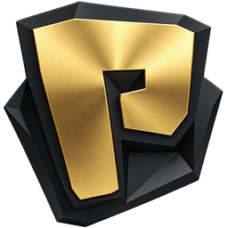
  </picture>
</p>

<h1 align="center">Modern Tiny Pedals</h1>

<p align="center">
  <b>Telemetry overlays and analysis tools for Le Mans Ultimate and rFactor 2</b><br>
  87 overlays with a modern design, a telemetry viewer, race strategy and driver stats.<br>
  Free and open source, in English and French.
</p>

<p align="center">
  <a href="https://github.com/Keenny38/ModernTinyPedals/releases/latest"></a>
  <a href="https://github.com/Keenny38/ModernTinyPedals/releases"></a>
  <a href="LICENSE.txt"></a>
  
</p>

<p align="center">
  <a href="https://github.com/Keenny38/ModernTinyPedals/releases/latest"><b>Download</b></a> ·
  <a href="#quick-start">Quick start</a> ·
  <a href="#features">Features</a> ·
  <a href="https://github.com/Keenny38/ModernTinyPedals/wiki">Wiki</a> ·
  <a href="CHANGELOG.md">Changelog</a> ·
  <a href="docs/ROADMAP.md">Roadmap</a>
</p>

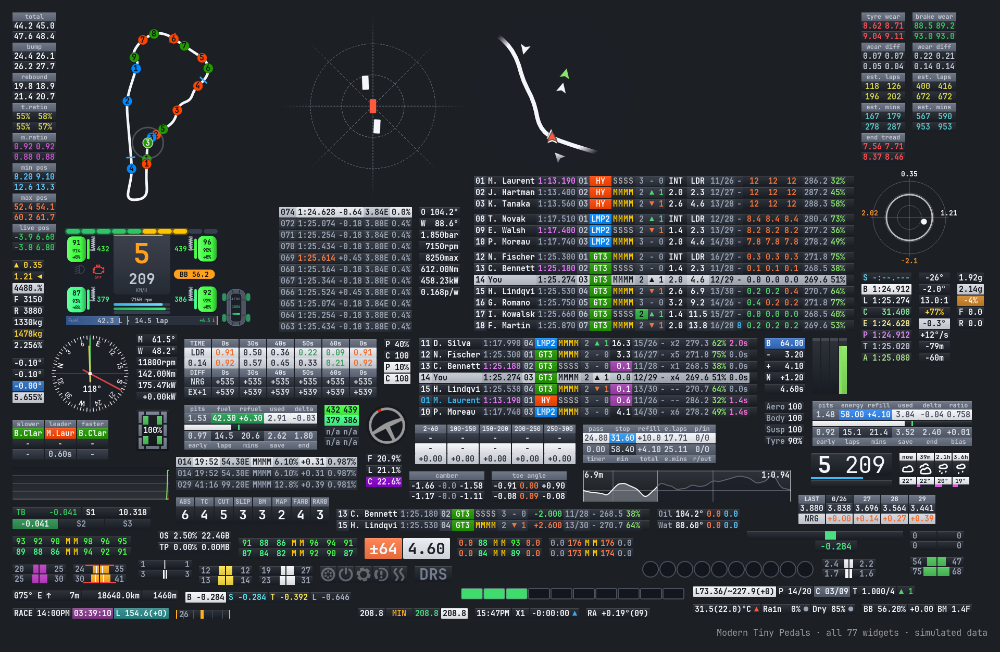

Modern Tiny Pedals is a modernized version of [TinyPedal](https://github.com/TinyPedal/TinyPedal): the same solid base, with a new design, a redesigned interface, new tools and a lot of work on reliability.

> [!NOTE]
> **New in 0.22.0**: ten more overlays get their own **modern design**, drawn for it instead of the classic drawing in modern colors: **radar** (round, fading at its edge, glow toward the car alongside), **track map** (checkered start line, cars as numbered dots in class or race status colors), **navigation** (road with edge lines, view fading at its edge), **friction circle** (G rings, fading trace, peaks), **heading** (compass ring), **steering wheel**, **instrument** and **weather forecast** (icons drawn as shapes in the theme colors), **trailing** (soft areas under throttle and brake) and **track notes**, then **black box**, **chat**, **elevation**, **flag**, **steering meter**, **race notifications** and **RPM LED**: every overlay has a modern design now. The **spotter** flashes green once the car alongside is gone and warns of a car coming up behind on a side. Placing overlays on the game screen is now an **edit mode** with a toolbar (snapping, grid, guides, undo), arrow keys and a richer right-click menu. **Real car brand and circuit logos, car and circuit pictures** taken from Le Mans Ultimate itself (kept on your computer, nothing shipped with the app) in the overlays, the app pages and the stream overlay of race results. All the details, with screenshots, in the [changelog](CHANGELOG.md).
>
> **0.22.2** uses less CPU while driving: data modules skip work when the game sends no new data, map overlays only redraw when cars moved, VR and stream capture only copy changed overlays, and hidden app pages stop their timers and animations. A full code review fixed about 90 issues: the stream overlay access token and web dashboard access code are kept across restarts (OBS sources no longer break at each start), a language pack language is kept, a settings file locked by another program at start is never overwritten, and cut laps or out laps no longer spoil delta best, best sectors and the fuel pace.

---

## Quick start

1. **Download** `ModernTinyPedals-<version>-windows-setup.exe` from the [Releases](https://github.com/Keenny38/ModernTinyPedals/releases/latest) page and run it. No administrator rights needed: the app installs in your profile (`%LOCALAPPDATA%\Programs\Modern Tiny Pedals`).
2. **Prepare the game**: `Borderless` or `Windowed` display mode (exclusive fullscreen hides the overlay), then the setting of your game below.
3. **On first launch**, the setup wizard asks for the language, the game (a running game is picked for you), metric or imperial units, the themes (previewed) and the overlays to start with (shown as pictures).
4. **Start a session**: the overlay shows up as soon as the car is on track and hides otherwise.

Then:

- **Move the overlays**: unlock the overlay (`Unlock Overlay` on the Home page, or notification area icon menu > `Lock Overlay`): move the mouse over an overlay and drag it: it snaps to the screen and to each other overlay, arrow keys move the selected one and `Ctrl+Z` undoes. The edit mode toolbar (snapping, grid, guides, undo) is in the right-click menu of an overlay (`Edit Mode`), or shown at each unlock with `Config > Application > Overlay Editing > enable_edit_mode_on_unlock`. Or use `Tools > Layout Editor` on a screenshot of the game.
- **Configure an overlay**: gear of its card in the `Overlays` tab (or right-click the overlay) opens the Overlay Options page, where every overlay is one click away. `Ctrl+F` searches for an option by name.
- **Updates**: the app tells you about a new version, shows its release notes in your language and can download and install it (`Download And Install`).

Each release has the Windows installer (`-windows-setup.exe`, also zipped as `-setup.zip`) and the source code (`-source.zip`). The portable ZIP is no longer published: to turn an older portable copy into an installed one, install the setup into its folder, your presets and data are kept. See [Installation](https://github.com/Keenny38/ModernTinyPedals/wiki/Installation) for details and for verifying your download.

### Game setup

| Game | Windows | Linux |
|---|---|---|
| **Le Mans Ultimate** | Nothing to install. Enable `Settings > Gameplay > Enable Plugins`. | Needs a third-party plugin, see [this discussion](https://github.com/TinyPedal/TinyPedal/issues/9). |
| **rFactor 2** | [rF2SharedMemoryMapPlugin](https://github.com/TheIronWolfModding/rF2SharedMemoryMapPlugin#download) plugin. | [Wine version of the plugin](https://github.com/schlegp/rF2SharedMemoryMapPlugin_Wine/blob/master/build). |

For rFactor 2: copy `rFactor2SharedMemoryMapPlugin64.dll` into `rFactor 2\Bin64\Plugins` (create the folder if it is missing), enable it in `Settings > Gameplay > Plugins`, then restart the game. If the plugin does not show up, install the `Visual C++ 2013` runtime found in the game's `Support\Runtimes` folder.

With Le Mans Ultimate, the app also reads the game's local REST API (nothing to set up): chat, contacts, replays, team stints, fuel consumption estimate, official track layouts, and the real car brand logos, circuit logos, car pictures and circuit pictures of the game menus.

---

## Features

### Overlays with a modern design

87 configurable overlays: tyres, brakes, fuel and energy, delta, timing, standings, radar, map, weather, engine, suspension, chat…

- **One rounded panel per overlay**, Barlow font, short translated labels above the values.
- **Values colored by meaning**: gain, loss, warning, best time.
- **Standings** as rows with position badge, class pill and position in class, columns of your choice.
- **Fuel and energy** with gauge and marks, **tyres and brakes** as tiles in the heatmap colors, **LEDs** as glowing dots.
- **Real logos & pictures of the game** (Le Mans Ultimate): car brand logos in Relative, Standings and Rivals, circuit and brand logos, car and circuit pictures on the Home, Race Results, Driver Stats, Spectate, Replays, Race Calculator and Telemetry pages and in the stream overlay of race results. They are taken from the game running on your computer and kept in the `gameimage` folder (your own logos in `brandlogo` come first).
- **Graphic overlays drawn for the design**: round radar fading at its edge, track map with numbered car dots and a checkered start line, navigation view, friction circle with a fading trace, compass heading, steering wheel, instrument and weather icons drawn as shapes in the theme colors.
- **Flags as colored chips** (caption above value, only while active), **chat** feed with sender colors, **elevation** profile with the driven part highlighted, **race notifications** with icons and a time bar, **steering meter** growing from center, **RPM LEDs** showing their color zones before they light up.
- **Simplified options**: the configuration only shows what the design uses. The classic look is still available, for every overlay (Legacy themes) or just one.
- **Four themes**: Modern Dark, Modern Light, Legacy Dark and Legacy Light (original TinyPedal look), each with a colorblind safe variant. Light themes keep flags and warnings in their colors and darken the others so they stay readable.
- **Visibility by session** (practice, qualifying, race) and pit lane, with fade.
- **Race aids**: delta graph over the lap, gap trend ahead and behind, pit lane helper (speed limit, pit limiter, distance to the box), stint timer and driving time per driver, spotter on the screen edges, race notifications, tyre temperature trend, and **telemetry compare**: your live speed, pedals, steering and gear over the reference lap of the telemetry viewer, with the next braking point ahead of the car, delta and speed difference.

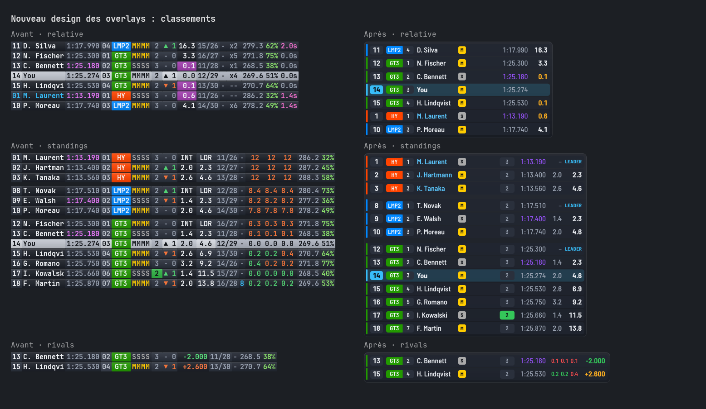

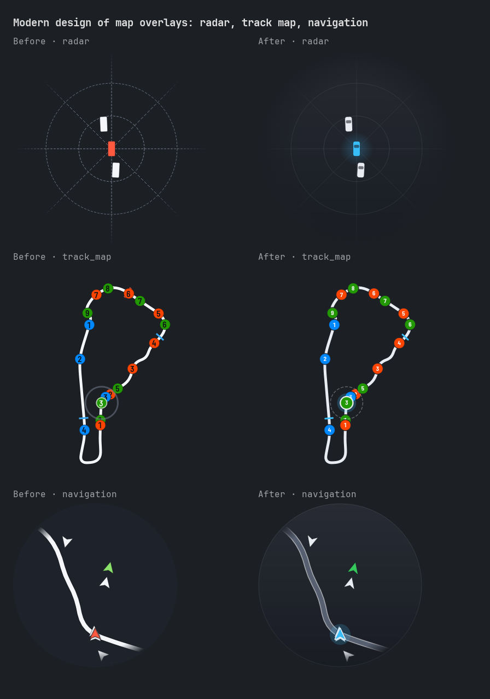

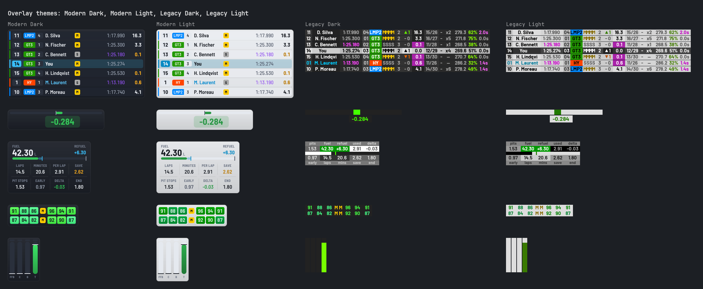

**Black box**: tyres, brakes, suspension, damage, fuel and energy gauges, incident log (contacts with the other driver's name, penalties, track limits) and ABS, TC, brake bias and engine map chips, with no overlap even when the wheels turn. In the modern design it keeps its layout and all its options, drawn in the Barlow font and the theme colors.

### Telemetry viewer

Every lap is recorded and analyzed in a GPU-drawn viewer: smooth zoom, laps grouped by session, several laps overlaid.

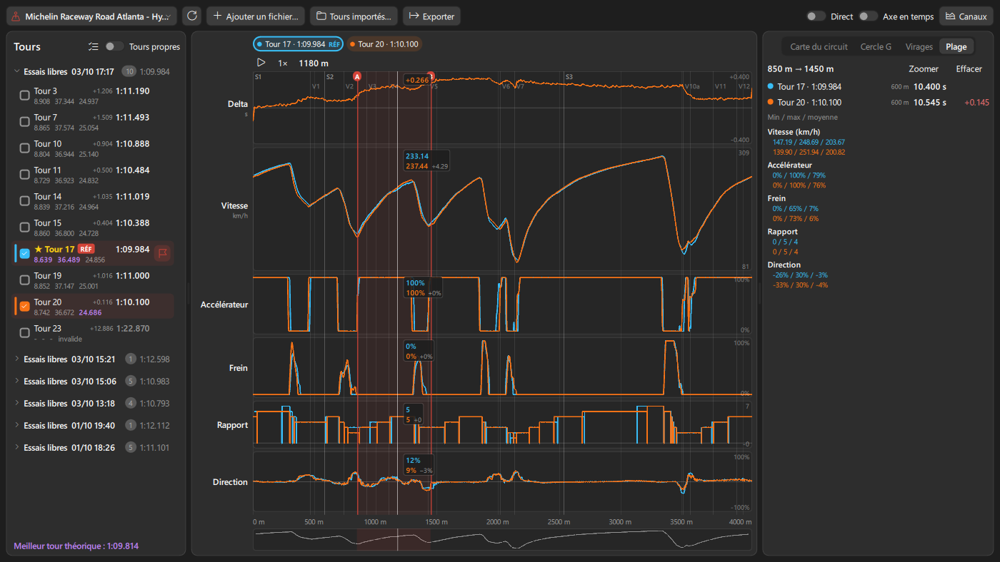

- **Charts**: gap to reference at the cursor, A/B markers and range statistics, computed channels (wheel slip, steering speed, fuel used), 4-wheel panels, min/max band, smoothing, animated lap playback, Live mode.
- **Track map**: official layout and track edges from the game (LMU), braking, apex, exit and outside points of each lap, off-tracks and track limits, 9 colorings (by lap, gain/loss, speed, pedals, racing line, gear, altitude, gap per corner, mini-sectors), ruler, mini-map.
- **Corners**: time, entry, minimum and exit speeds, gear, brake pressure, ideal lap, and **where the time is lost** with the reason in plain words ("Brakes 6 m earlier").
- **Session**: long run pace and lap time trend, fuel and wear of each lap. **XY**: scatter plot or histogram of any channels.
- **Tools**: search, trash with undo, lap used as delta best, open the replay at the cursor, **MoTeC `.ld`**, CSV and image export, MoTeC log import to compare with another driver's lap.
- **On track**: the Telemetry Compare overlay draws your live speed and inputs over the reference lap chosen in the viewer.
- **In-depth analysis**: values fitted to the visible part, math channels from a formula, laps aligned on braking, consistency per mini-sector, teammate laps, best lap in similar conditions, setup differences, corner report as HTML or PDF.

| Official layout, track edges and mini-sectors | Where the time is lost |
|---|---|
| 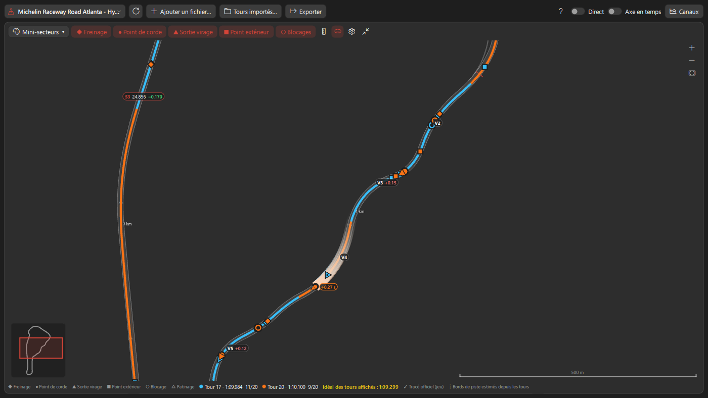 | 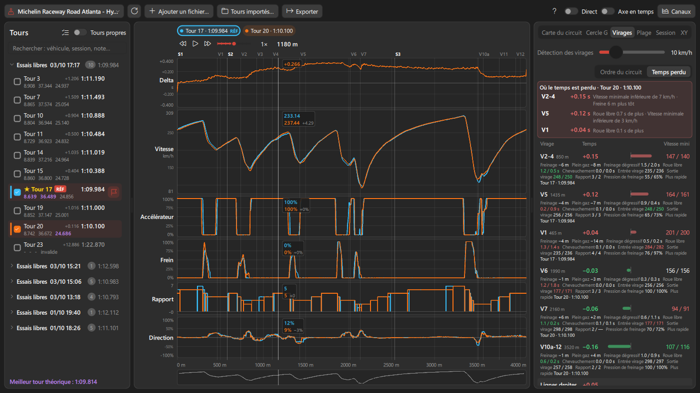 |
| **Session: long run and trend** | **XY: speed / lateral G** |
| 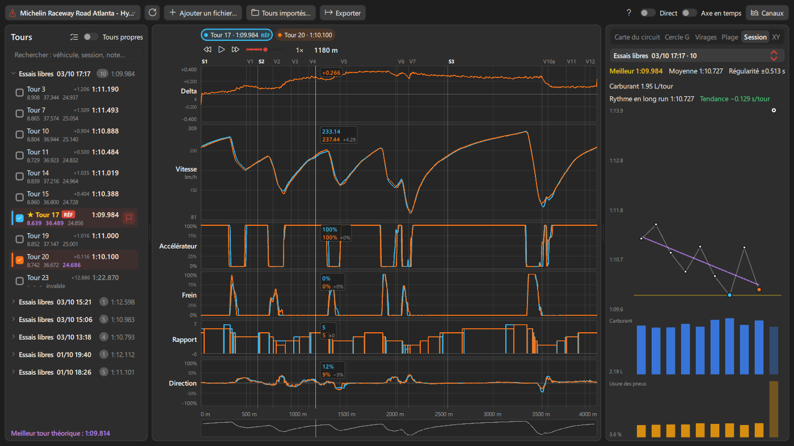 | 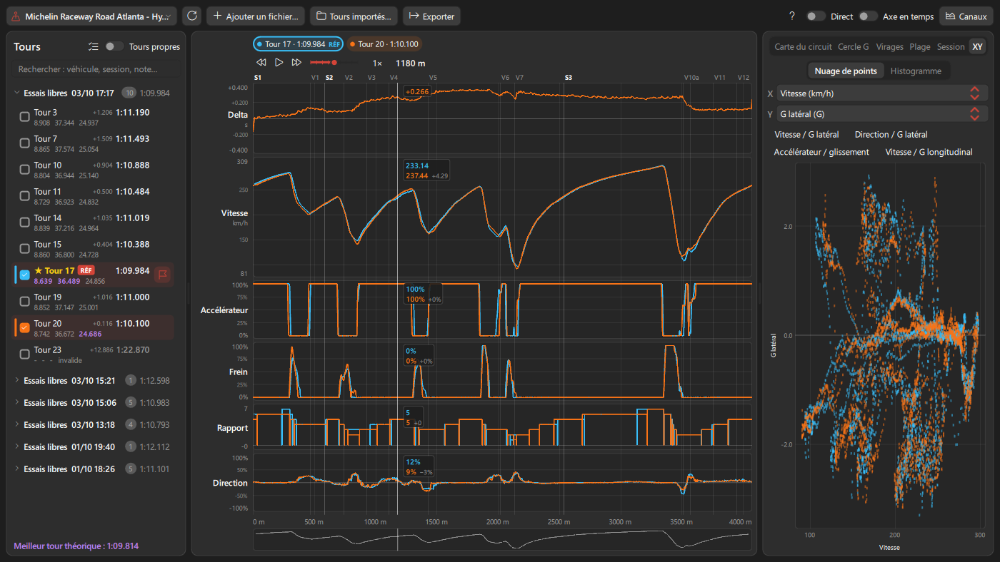 |

The **track map viewer** also shows each track by sectors with the real corner numbers, the curvature and slope at each point, the altitude profile and an animated run.

### Race calculator

Fuel, energy and tyres on one page, to prepare a race and follow it live.

- **Modern page**: key figures and the strategy timeline (with the fuel in the tank) always in view, input sections that fold, tyres dragged from the stock onto the wheels of the tyre plan, values stepped with the arrow keys, and only what changes is redrawn.
- **Pit stop plan** lap by lap: full tank or just what is needed, tyres, driver, stop duration, pit window, time of each stop. Stints limited by tyre life if you want.
- **Safety car and rain scenarios**, compared with the normal plan. **Strategy comparison** with one stop less (fuel saving) or more, and the cost of saving.
- **Several drivers** with minimum and maximum driving time, balanced stints, mandatory stops, maximum stint, fuel effect.
- **Live race**: the plan for the rest of the race is recalculated every lap from the car, with the driver of each stint.
- **Team tab (LMU)**: stints of each driver of the car read from the game, teammates included.
- **Sharing**: one-line share code, export for Discord, CSV or image, plan saved per car and track.
- The **Race plan** overlay shows the next stop of the plan on track, the distance to the pit entry and the target consumption.

<p align="center">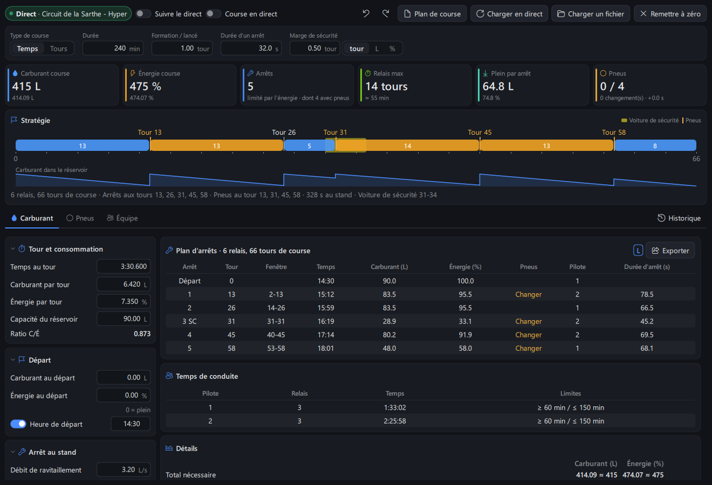</p>

### Driver stats

Your numbers per track and per car, compared with the LMU community times (sheet by [ohne_speed](https://www.youtube.com/@ohne_speed)), with a level from Alien to Offline.

- **Level scale** of each vehicle: where your personal best, qualifying and race bests stand, and the time to find for the **next level**.
- **Progress** of your session best, session after session, next to the list of **sessions** with race results.
- **All tracks**: your career on one page, with the level of each best lap, a **daily activity calendar** and your **recent sessions**.
- **Theoretical** best lap and potential, starts, wins, podiums, retirements, consumption per 100 km.
- **Telemetry** button to open the vehicle's recorded laps in the viewer.
- **Pace and degradation per tyre compound**, consistency index, CSV / JSON export and **comparison with a friend**.

| Track: level scale, progress, sessions | All tracks: activity, recent sessions |
|---|---|
| 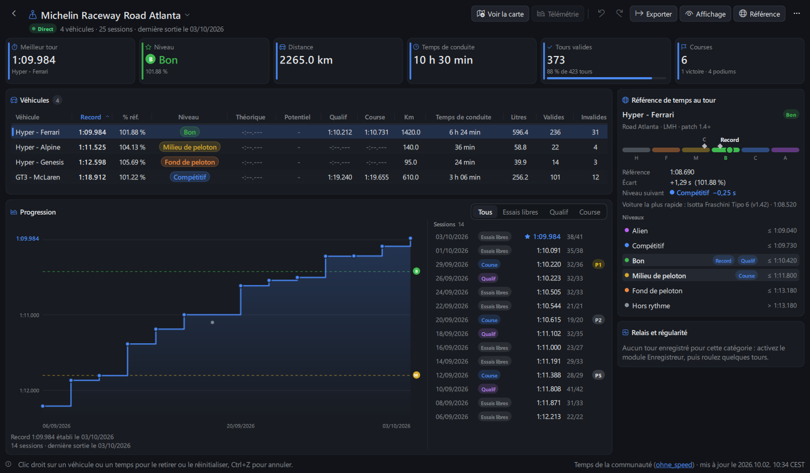 | 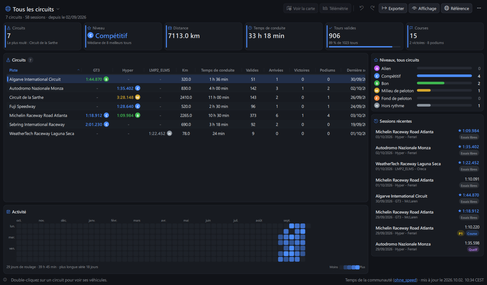 |

### Race results

Every session you played, online or single player, read from the results files of Le Mans Ultimate and rFactor 2: no setup, the game does not need to run.

- **Sessions** by day with your result, search and filter (races, qualifying, practice); a session that ends while the page is open shows up at once.
- **Your key figures**: position and class position, places gained from the grid, best lap and its rank, laps and pit stops, contacts, track limits and penalties.
- **Classification** by class, with race time and gaps (also for a race left before its end), best laps, pit stops and contacts.
- **Positions lap by lap**, the **laps of any car** (sectors, top speed, tyres, energy used and tread left for your car) and the **events** of the session: contacts, penalties, track limits and chat.

| Classification of a multiclass race | Positions lap by lap |
|---|---|
| 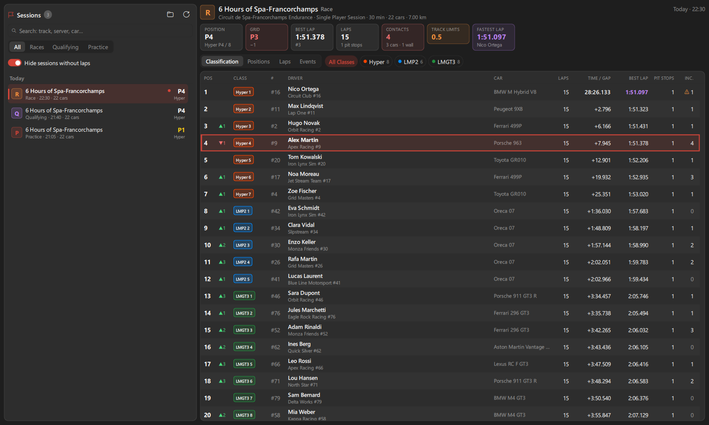 | 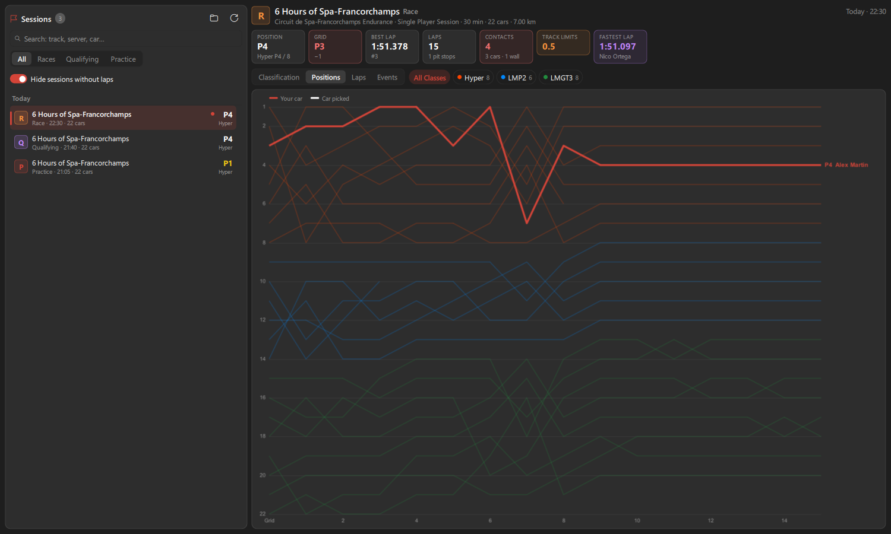 |

### Le Mans Ultimate: game data

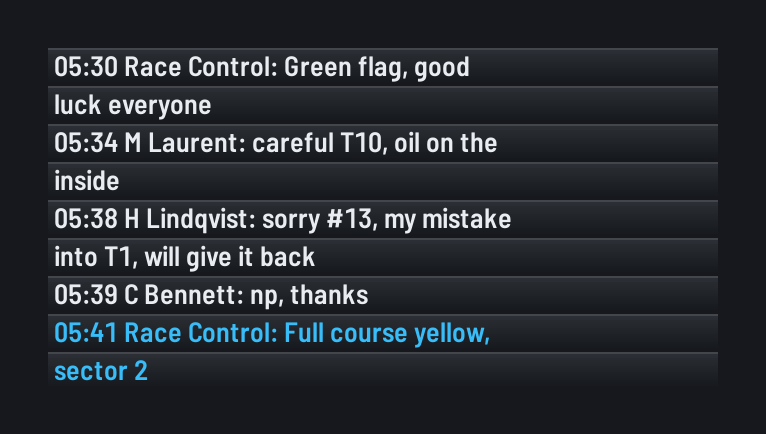

- In-game **chat** as an overlay, handy in VR.
- **Game replays**: replays by day with search and filters, add / export / rename / protect / delete replays and clean the folder up, open in the game, playback, camera and HUD controls, drivers standings, track map with the cars, incident timeline with a jump to each incident (also from a live session).
- **Contacts** written to the Black box log, with the other driver's name.
- **Fuel consumption estimated by the game** until a lap is recorded on the track.
- **Setup name** kept with each recorded lap.
- **Allowed tyres** and **team stints** used by the race calculator.
- **In the overlays**: official delta, invalidated lap, puncture, ideal tyre temperature, sector yellow flags and full course yellow, wind, ride height, pit limiter, engine overheating.

<br clear="right">

### Interface

- Qt 6 interface in **English or French** (switch without restarting), translated option names and tooltips, **release notes in the app language**.
- **Home page**: game and current session status, overlay lock, last session, customizable quick access (tools, pages, actions) and **release notes of the installed version**.
- **Overlays page**: every overlay as a card with a preview drawn with your settings (or a compact list), search ignoring accents, category chips with counts, enable / disable the filtered overlays, start errors flagged.
- **Modules page**: what each data module computes, its state, the enabled overlays and modules using its data (a module turned off that they need is flagged), reset of its saved data.
- **Everything opens inside the app window**: tools, editors and settings are pages, with back navigation (`Alt+←` or the mouse back button). A page you leave closes by itself (unless it has unsaved changes), so pages never pile up. Navigation bar tools stay as you left them and come back on next start, even after a crash.
- **Window size handled for you**: comfortable size centered on screen at first launch, size, position and maximized state remembered (even after a crash), wide pages grow the window only while open and keep it on screen, window brought back on screen when a monitor is unplugged, never shrunk below the size where pages show correctly (more for the telemetry viewer and driver stats), `Window` > `Reset Window Size and Position`.
- **Overlay Options page**: the options of every overlay in one page, overlays listed by category. Options in sections (general, position and layout, font, then one per item shown with its on/off switch, display order as a list), options of an item that is off dimmed, only the options of the design in use. Search this overlay or every overlay, `Changed only`, `Apply to All Overlays` for a shared option (font, opacity...), live preview with the unsaved values (sample race for Relative, Standings and Rivals, whose columns are one list to switch on or off and reorder), changes to several overlays kept pending with undo and applied at once (only the edited overlays restart).
- **Config page** (navigation bar, `Ctrl+,`): every global option in one page by category (Application, Overlay Style, Notification, Compatibility, Remote Control, Web Dashboard, Stream Overlay, VR Overlay, User Path), with descriptions, a search through every category, changes kept pending with undo, discard and apply, notice previews, the web dashboard address and access code.
- **Find Option** (`Ctrl+F`): best matches first with the current value of each option, options changed from default marked (`Changed only` lists them all), on / off options switched right in the list.
- **Presets page**: loaded preset and auto load on top, every preset with its last change, the overlays and modules it turns on, its car class and track tags and hotkeys, details of the selected preset, name checked as you type for new, duplicate and rename.
- **Spectate page**: drivers of the session with place, class, car and best lap; click a driver to follow it, previous / next by place.
- **Setup wizard** (first launch, `Help` > `Setup Wizard`): six steps that switch language at once, running game detected, metric or imperial units, window and overlay themes previewed with real overlays, new or existing preset with overlays picked from pictures, summary before anything is applied.
- **Customizable navigation bar**, live overlay preview, undo / redo in editors.
- **Overlay edit mode** on the game screen: toolbar (snapping, grid, guides, undo / redo, active overlays), every overlay outlined even when empty or auto hidden, magnetic snapping with alignment guides and position, arrow keys, right-click menu to move to another screen or set visibility and opacity, overlays outside every screen brought back.
- **Layout editor** with alignment guides and snapping, global scale, positions remembered per screen setup.
- **Preset share code**: copy a preset as text, import it with a preview. **Preset trash** with undo.
- **Unsaved changes** flagged on each page, `Ctrl+S` to save, values checked as you type.
- **Session recorder** (`Tools` > `Advanced`): record a session and replay it in every overlay, without the game, to test overlays or attach to a bug report.
- **Four window themes**: Modern Dark, Modern Light, Legacy Dark and Legacy Light (colors of TinyPedal 2.50), switched from the status bar.
- Gold and black or gold and white icon, following the Windows light or dark mode.

### Connections

- **Remote control** for Stream Deck, Companion or SimHub, and live telemetry stream over WebSocket.
- **Web dashboard** for phone or tablet, in your units and language, with access code and optional HTTPS.
- **Stream overlays** for OBS Studio, Streamlabs, XSplit or vMix: the overlays as browser sources (whole layout or one by one), transparent and exactly as on screen, also with the game in exclusive fullscreen. Each overlay on screen and stream, stream only or screen only, and the **classification of the last race** for your viewers, classes and pages cycling.
- **VR**: experimental SteamVR overlay, and a mirror window for OpenXR games (to show in the headset with OpenKneeboard, OVR Toolkit, XSOverlay or Desktop+).

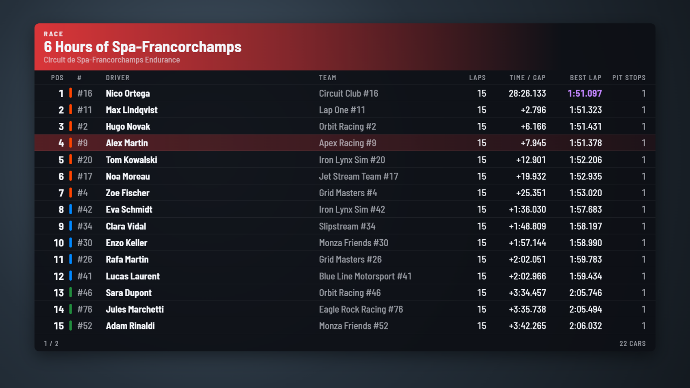

### Reliability

- Windows installer and **updates from the app**, with a check of the downloaded file (SHA-256, and signature when the installer is signed).
- Automatic backups of presets and stats, atomic file writes, automatic restart of crashed threads.
- Overlay plugins with a manager, one-click bug report, performance monitor with the game data status.
- **Light on memory**: overlays turned off and pages not opened are never loaded, and the main window frees its pages and graphics while it waits in the tray.
- **Safe mode** offered after a crash at launch (no plugins nor overlays).
- **More than 2,300 automated tests** (91% of the code covered), type checking and lint in continuous integration, the executable is started in test mode before each release.

---

## Documentation

The [wiki](https://github.com/Keenny38/ModernTinyPedals/wiki) is the user and developer guide:

| Use | Develop |
|---|---|
| [Installation](https://github.com/Keenny38/ModernTinyPedals/wiki/Installation) · [Game setup](https://github.com/Keenny38/ModernTinyPedals/wiki/Game-Setup) · [Getting started](https://github.com/Keenny38/ModernTinyPedals/wiki/Getting-Started) | [Development](https://github.com/Keenny38/ModernTinyPedals/wiki/Development): run from source, checks, architecture, Windows build, release process |
| [Overlays](https://github.com/Keenny38/ModernTinyPedals/wiki/Overlays) · [Presets and settings](https://github.com/Keenny38/ModernTinyPedals/wiki/Presets-and-Settings) | [Contributing guide](CONTRIBUTING.md) |
| [Telemetry viewer](https://github.com/Keenny38/ModernTinyPedals/wiki/Telemetry-Viewer) · [Race calculator](https://github.com/Keenny38/ModernTinyPedals/wiki/Race-Calculator) · [Driver stats](https://github.com/Keenny38/ModernTinyPedals/wiki/Driver-Stats) · [Race results](https://github.com/Keenny38/ModernTinyPedals/wiki/Race-Results) | [Roadmap](docs/ROADMAP.md) |
| [Connections](https://github.com/Keenny38/ModernTinyPedals/wiki/Connections) · [Updates and security](https://github.com/Keenny38/ModernTinyPedals/wiki/Updates-and-Security) · [Troubleshooting](https://github.com/Keenny38/ModernTinyPedals/wiki/Troubleshooting) | [Security policy](SECURITY.md) |

Every option is described in the [settings reference](docs/customization.md) (also bundled with the app), and what changed in each version in the [changelog](CHANGELOG.md) ([en français](CHANGELOG.fr.md)). The wiki is generated from [docs/wiki](docs/wiki): edit it there.

## Run from source

Requires [Python](https://www.python.org/) 3.11 or newer.

```bash
git clone https://github.com/Keenny38/ModernTinyPedals.git
```

```bash
cd ModernTinyPedals
```

Create a virtual environment, activate it, then install the dependencies (PySide6, psutil, cryptography):

```bash
py -3.12 -m venv .venv
```

```bash
.venv\Scripts\activate
```

```bash
pip install -r requirements.txt
```

```bash
python run.py
```

The shared memory libraries (`pyLMUSharedMemory`, `pyRfactor2SharedMemory`) are included in the repository: no submodule to fetch. For exact tested versions, use `requirements-lock.txt`.

On Windows, `Download And Install` of an update found while running from source installs the Windows app (your installed copy is updated, then started); update the source folder itself with `git pull`.

On **Linux**, run the app from source the same way (no executable). Needed packages: `PySide6`, `psutil`, `cryptography` and `pyxdg`. `sudo ./install.sh` installs a launcher and the `TinyPedal` command in `/usr/local/`. Settings are in `$HOME/.config/TinyPedal/` and data in `$HOME/.local/share/TinyPedal/`. See [Installation](https://github.com/Keenny38/ModernTinyPedals/wiki/Installation#linux) for distribution packages and known issues (KDE, compositing).

> The display name is "Modern Tiny Pedals", but the internal name stays `TinyPedal` (configuration folder `%APPDATA%\TinyPedal`, `tinypedal.exe`, `X-TinyPedal` remote control header), to keep existing settings and tool compatibility.

## Contributing

Report a problem or suggest an idea in the [issues](https://github.com/Keenny38/ModernTinyPedals/issues). The contribution rules (development setup, checks, project rules) are in [CONTRIBUTING.md](CONTRIBUTING.md), and what is left to do in the [roadmap](docs/ROADMAP.md). A security vulnerability is reported privately, not in an issue: see [SECURITY.md](SECURITY.md).

## License and credits

Modern Tiny Pedals is derived from [TinyPedal](https://github.com/TinyPedal/TinyPedal), Copyright (C) 2022-2026 TinyPedal developers. See [docs/contributors.md](docs/contributors.md) for the list of developers and contributors.

Free software under the [GNU GPL v3](LICENSE.txt) or any later version, distributed WITHOUT ANY WARRANTY. The icon and the images of the `images` folder are under [CC BY-SA 4.0](https://creativecommons.org/licenses/by-sa/4.0/). The [Barlow](https://github.com/jpt/barlow) font is under the SIL Open Font License 1.1 (`fonts/OFL-Barlow.txt`). Third-party software licenses are in [docs/licenses](docs/licenses/THIRDPARTYNOTICES.txt).
