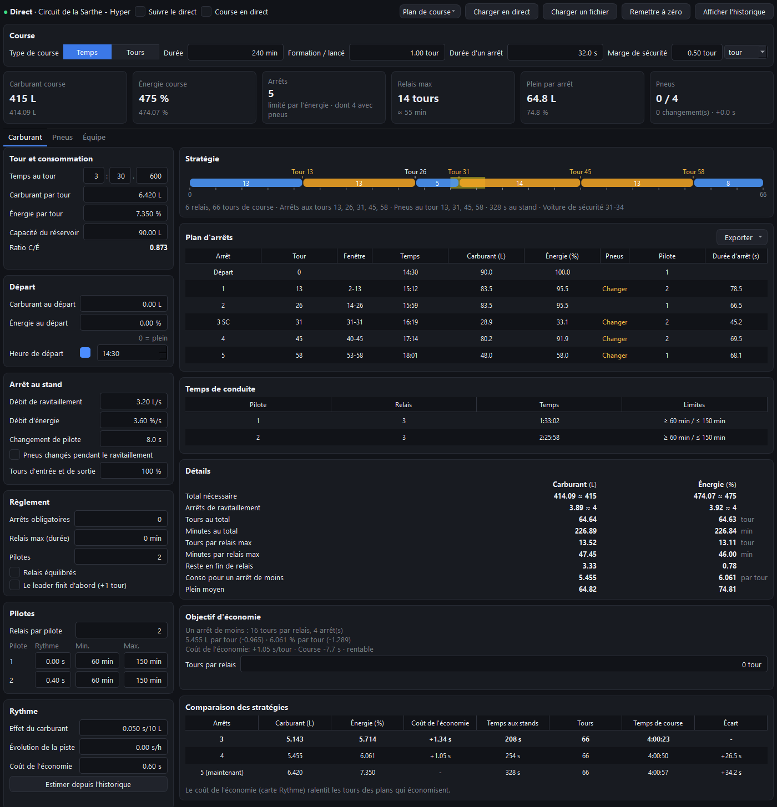
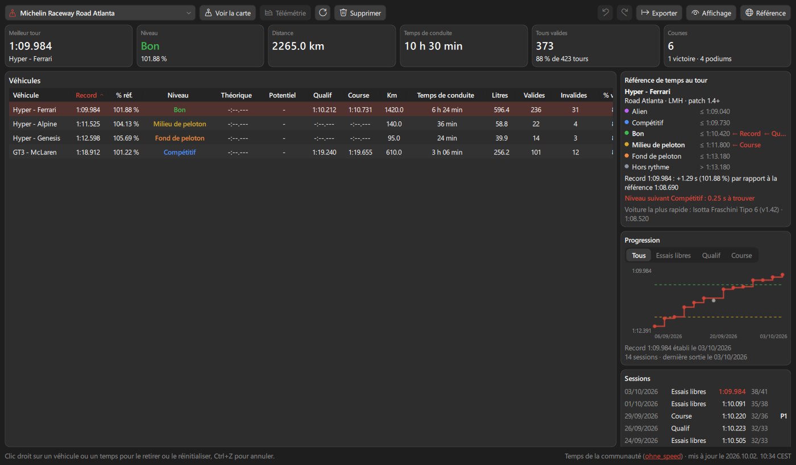
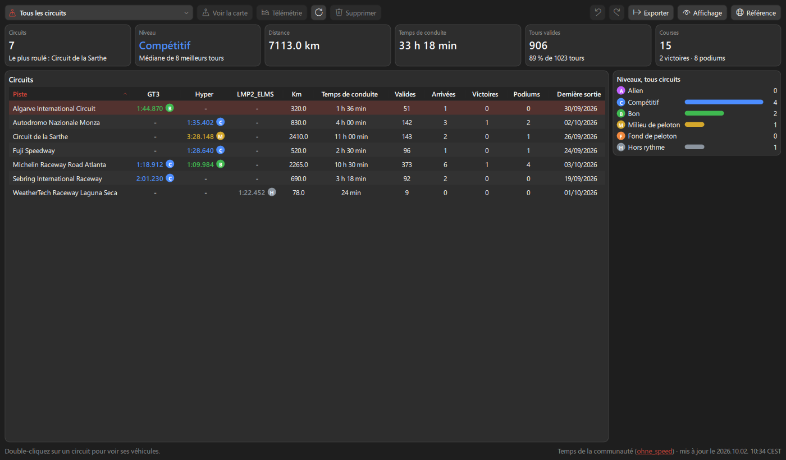

<p align="center">
  <picture>
    <source media="(prefers-color-scheme: dark)" srcset="images/icon_dark.png">
    
  </picture>
</p>

<h1 align="center">Modern Tiny Pedals</h1>

<p align="center">
  <b>Overlay de télémétrie et outils d'analyse pour Le Mans Ultimate et rFactor 2</b><br>
  79 overlays au design moderne, visionneuse de télémétrie, stratégie de course et statistiques pilote.<br>
  Libre, gratuit et en français.
</p>

<p align="center">
  <a href="https://github.com/Keenny38/ModernTinyPedals/releases/latest"></a>
  <a href="https://github.com/Keenny38/ModernTinyPedals/releases"></a>
  <a href="LICENSE.txt"></a>
  
</p>

<p align="center">
  <a href="https://github.com/Keenny38/ModernTinyPedals/releases/latest"><b>Télécharger</b></a> ·
  <a href="#démarrage-rapide">Démarrage rapide</a> ·
  <a href="#fonctionnalités">Fonctionnalités</a> ·
  <a href="docs/customization.md">Guide des réglages</a> ·
  <a href="CHANGELOG.md">Changelog</a> ·
  <a href="docs/ROADMAP.md">Feuille de route</a>
</p>


Modern Tiny Pedals est une version modernisée de [TinyPedal](https://github.com/TinyPedal/TinyPedal) : la même base solide, avec un nouveau design, une interface repensée, de nouveaux outils et beaucoup de travail sur la fiabilité.

> [!NOTE]
> **Nouveau dans la 0.19.0** : nouveau design pour tous les overlays (sauf le Black box), nouvelle icône, statistiques pilote refaites (carrière, progression, sessions), calculateur de course avec voiture de sécurité, pluie et plusieurs pilotes, tracé officiel et limites de piste dans la visionneuse de télémétrie, et de nouvelles données de Le Mans Ultimate : chat en overlay, rejeux et contacts, relais de l'équipe. Tout le détail, avec des captures, dans le [changelog](CHANGELOG.md).

---

## Démarrage rapide

1. **Télécharge** `ModernTinyPedals-<version>-windows-setup.exe` sur la page [Releases](https://github.com/Keenny38/ModernTinyPedals/releases/latest) et lance-le. Pas besoin de droits administrateur : l'app s'installe dans ton profil (`%LOCALAPPDATA%\Programs\Modern Tiny Pedals`).
2. **Prépare le jeu** : mode d'affichage `Sans bordure` ou `Fenêtré` (le plein écran exclusif cache l'overlay), puis le réglage de ton jeu ci-dessous.
3. **Au premier lancement**, l'assistant te demande la langue, le jeu, le thème et les overlays de départ.
4. **Lance une session** : l'overlay apparaît dès que la voiture est en piste et se cache sinon.

Ensuite :

- **Déplacer les overlays** : déverrouille l'overlay (menu de l'icône dans la zone de notification > `Verrouiller l'overlay`) puis fais-les glisser, ou utilise `Outils > Éditeur de disposition` sur une capture du jeu.
- **Régler un overlay** : onglet `Overlays` de la fenêtre principale, ou `Ctrl+F` pour chercher une option par son nom.
- **Mises à jour** : l'app te prévient d'une nouvelle version, affiche ses nouveautés et peut la télécharger et l'installer (`Télécharger et installer`).

Une version ZIP portable existe aussi. Ne l'extrais pas dans `Program Files` ni dans le dossier du jeu : l'app enregistre ses réglages à côté de l'exécutable.

### Réglage du jeu

| Jeu | Windows | Linux |
|---|---|---|
| **Le Mans Ultimate** | Rien à installer. Active `Paramètres > Gameplay > Activer les plugins`. | Nécessite un plugin tiers, voir [cette discussion](https://github.com/TinyPedal/TinyPedal/issues/9). |
| **rFactor 2** | Plugin [rF2SharedMemoryMapPlugin](https://github.com/TheIronWolfModding/rF2SharedMemoryMapPlugin#download). | [Version Wine du plugin](https://github.com/schlegp/rF2SharedMemoryMapPlugin_Wine/blob/master/build). |

Pour rFactor 2 : copie `rFactor2SharedMemoryMapPlugin64.dll` dans `rFactor 2\Bin64\Plugins` (crée le dossier s'il manque), active-le dans `Paramètres > Gameplay > Plugins`, puis redémarre le jeu. Si le plugin n'apparaît pas, installe le runtime `Visual C++ 2013` fourni dans `Support\Runtimes` du jeu.

Avec Le Mans Ultimate, l'app lit aussi l'API REST locale du jeu (rien à configurer) : chat, contacts, rejeux, relais de l'équipe, estimation de conso, tracé officiel des circuits.

---

## Fonctionnalités

### Overlays au design moderne

79 overlays configurables : pneus, freins, carburant et énergie, delta, chronos, classements, radar, carte, météo, moteur, suspensions, chat…

- **Un panneau arrondi par overlay**, police Barlow, libellés courts traduits au-dessus des valeurs.
- **Valeurs colorées selon leur sens** : gain, perte, alerte, meilleur temps.
- **Classements** en lignes avec badge de position, pastille de classe et position dans la classe, colonnes au choix.
- **Carburant et énergie** avec jauge et repères, **pneus et freins** en tuiles aux couleurs de la heatmap, **LED** en pastilles lumineuses.
- **Options simplifiées** : la configuration n'affiche que ce que le design utilise. L'ancien look reste disponible, pour tous les overlays ou un seul.
- **Thèmes** (sombre, contraste élevé, adapté au daltonisme, classique), éditeur de thèmes, thème par overlay, export et import.
- **Affichage selon la session** (essais, qualif, course) et le passage aux stands, avec fondu.


**Black box** : pneus, freins, suspensions, dégâts, jauges carburant et énergie, journal des incidents (contacts avec le nom de l'autre pilote, pénalités, limites de piste) et pastilles ABS, TC, répartition de freinage et cartographie moteur, sans aucun chevauchement même quand les roues braquent.

### Visionneuse de télémétrie

Chaque tour est enregistré et s'analyse dans une visionneuse dessinée par la carte graphique : zoom fluide, tours regroupés par session, plusieurs tours superposés.


- **Courbes** : écart à la référence au curseur, repères A/B et statistiques de plage, canaux calculés (glissement des roues, vitesse de braquage, carburant consommé), panneaux 4 roues, bande min/max, lissage, lecture animée du tour, mode Direct.
- **Carte de trajectoire** : tracé officiel et bords de piste du jeu (LMU), points de freinage, de corde, de sortie et point extérieur de chaque tour, hors-pistes et limites de piste, 9 colorations (par tour, gain/perte, vitesse, pédales, trajectoire, rapport, altitude, écart par virage, mini-secteurs), règle, mini-carte.
- **Virages** : temps, vitesses d'entrée, mini et de sortie, rapport, pression de freinage, tour idéal, et **où le temps est perdu** avec la cause en clair (« Freine 6 m plus tôt »).
- **Session** : rythme en long run et tendance du temps au tour, carburant et usure de chaque tour. **XY** : nuage de points ou histogramme de n'importe quels canaux.
- **Outils** : recherche, corbeille avec annulation, tour utilisé comme delta meilleur tour, ouverture du replay au curseur, export **MoTeC `.ld`**, CSV et image, import d'un journal MoTeC pour se comparer au tour d'un autre pilote.

| Tracé officiel, bords de piste et mini-secteurs | Où le temps est perdu |
|---|---|
|  |  |
| **Session : long run et tendance** | **XY : vitesse / G latéral** |
|  |  |

La **visionneuse de carte de piste** montre aussi chaque circuit par secteurs avec les vrais numéros de virages, la courbe et la pente à chaque point, le profil d'altitude et un parcours animé.

### Calculateur de course

Carburant, énergie et pneus dans une seule page, pour préparer une course et la suivre en direct.

- **Plan d'arrêts** tour par tour : plein ou juste ce qu'il faut, pneus, pilote, durée de l'arrêt, fenêtre d'arrêt, heure de chaque arrêt.
- **Scénarios** voiture de sécurité et pluie, comparés au plan normal. **Comparaison des stratégies** avec un arrêt de moins (économie) ou de plus, et le coût de l'économie.
- **Plusieurs pilotes** avec temps de conduite minimum et maximum, relais équilibrés, arrêts obligatoires, relais max, effet du carburant.
- **Course en direct** : le plan de la fin de course est recalculé à chaque tour à partir de la voiture.
- **Onglet Équipe (LMU)** : relais de chaque pilote de la voiture lus dans le jeu, coéquipiers compris.
- **Partage** : code de partage d'une ligne, export pour Discord, CSV ou image, plan enregistré par voiture et circuit.
- Le widget **Plan de course** affiche en piste le prochain arrêt du plan, la distance jusqu'à l'entrée des stands et la conso cible.

<p align="center"></p>

### Statistiques pilote

Tes chiffres par circuit et par voiture, comparés aux temps de la communauté LMU (feuille d'[ohne_speed](https://www.youtube.com/@ohne_speed)), avec un niveau d'Alien à Hors rythme.

- **Tous les circuits** : ta carrière sur une page, avec le niveau de chaque meilleur tour.
- **Progression** de ton record session après session, et liste des **sessions** avec les résultats de course.
- Meilleur tour **théorique** et potentiel, temps à trouver pour le **niveau suivant**, départs, victoires, podiums, abandons, conso aux 100 km.
- Bouton **Télémétrie** pour ouvrir les tours enregistrés du véhicule dans la visionneuse.

| Circuit : niveau, progression, sessions | Tous les circuits |
|---|---|
|  |  |

### Le Mans Ultimate : les données du jeu


- **Chat** du jeu en overlay, pratique en VR.
- **Rejeux du jeu** : ouverture dans le jeu, commandes de lecture, saut au moment de chaque contact.
- **Contacts** inscrits dans le journal du Black box, avec le nom de l'autre pilote.
- **Conso estimée par le jeu** tant qu'aucun tour n'est enregistré sur le circuit.
- **Nom du setup** gardé avec chaque tour enregistré.
- **Pneus autorisés** et **relais de l'équipe** repris dans le calculateur de course.

<br clear="right">

### Interface

- Interface Qt 6 en **français ou en anglais** (changement à chaud), noms et bulles d'aide des options traduits.
- **Tout s'ouvre dans la fenêtre de l'app** : outils, éditeurs et réglages sont des pages, avec retour à la page précédente (`Alt+←` ou bouton souris arrière). Les pages ouvertes se rouvrent au démarrage suivant, même après un plantage.
- **Barre de navigation personnalisable**, recherche globale d'option (`Ctrl+F`), aperçu en direct des overlays, annuler / rétablir dans les éditeurs.
- **Éditeur de disposition** avec guides d'alignement et magnétisme, échelle globale, positions mémorisées par configuration d'écran.
- **Code de partage de preset** : copier un preset en texte, l'importer avec un aperçu.
- **Rejeu de télémétrie** : enregistre une session et rejoue-la dans tous les overlays, sans lancer le jeu.
- Icône or et noir, ou or et blanc, selon le mode clair ou sombre de Windows.

### Connexions

- **Contrôle à distance** pour Stream Deck, Companion ou SimHub, et flux de télémétrie en direct par WebSocket.
- **Tableau de bord web** pour téléphone ou tablette, avec code d'accès et HTTPS en option.
- **VR** : overlay SteamVR expérimental, et fenêtre miroir pour les jeux OpenXR (à afficher dans le casque avec OpenKneeboard, OVR Toolkit, XSOverlay ou Desktop+).

### Fiabilité

- Installeur Windows et **mises à jour vérifiées** (SHA-256) depuis l'app.
- Sauvegardes automatiques des presets et des statistiques, écriture de fichiers atomique, redémarrage automatique des threads plantés.
- Plugins d'overlays avec gestionnaire, rapport de bug en un clic, moniteur de performance.
- **Plus de 1500 tests automatisés** (83 % du code couvert), vérification de types et lint en intégration continue.

Chaque option est détaillée dans le [guide des réglages](docs/customization.md), et les nouveautés de chaque version dans le [changelog](CHANGELOG.md).

---

## Lancer depuis le code source

Nécessite [Python](https://www.python.org/) 3.10 ou plus récent.

```bash
git clone https://github.com/Keenny38/ModernTinyPedals.git
```

```bash
cd ModernTinyPedals
```

Crée un environnement virtuel, active-le, puis installe les dépendances (PySide6, psutil, cryptography) :

```bash
py -3.12 -m venv .venv
```

```bash
.venv\Scripts\activate
```

```bash
pip install -r requirements.txt
```

```bash
python run.py
```

Les bibliothèques de mémoire partagée (`pyLMUSharedMemory`, `pyRfactor2SharedMemory`) sont incluses dans le dépôt : pas de sous-module à récupérer. Pour des versions exactes testées, utilise `requirements-lock.txt`.

### Développement

```bash
pip install -r requirements-dev.txt
```

Contrôles lancés en intégration continue (et avant chaque commit avec `pre-commit install`) :

```bash
ruff check .
```

```bash
mypy tinypedal
```

```bash
pytest --cov=tinypedal
```

Le benchmark des widgets se lance à part avec `pytest -m benchmark`. La CI échoue si la couverture totale des tests passe sous le seuil `fail_under` de `pyproject.toml` (81 %).

L'intégration continue installe toujours les dernières versions de `ruff` et `mypy`. Si un contrôle échoue en CI alors qu'il passe chez toi, mets-les à jour :

```bash
pip install -U ruff mypy
```

Après avoir ajouté des options ou modifié la documentation, régénère les libellés et les bulles d'aide :

```bash
python tools/gen_fr_options.py
```

```bash
python tools/gen_option_help.py
```

Le second script signale les bulles d'aide qui n'ont pas encore de traduction française (`tinypedal/i18n/data/fr_option_help.json`).

**Design des overlays** : chaque overlay (sauf le Black box) a sa version moderne dans `tinypedal/widget/_modern/<nom>.py`, enregistrée dans `tinypedal/template/widget/modern.py` avec les options qu'elle lit (les seules affichées dans la configuration). Les composants communs (tuiles de valeurs, tableaux, jauges, roues, restylage des overlays graphiques) sont dans le même dossier. Les libellés des overlays passent par `tr_overlay` (`tinypedal/i18n/fr_overlay.py`), pas par `tr` : ils doivent rester courts. La police Barlow est dans `fonts`.

**Pages Qt Quick** : la visionneuse de télémétrie, le Track Map Viewer et les statistiques pilote sont en QML dans `tinypedal/ui/qml`, avec leur état dans `tinypedal/ui/quick` (Python pur, testable sans affichage). Courbes et cartes sont envoyées une seule fois à la carte graphique (`GpuShape`), le zoom ne fait que changer une matrice. Un nouveau module QML importé par une page doit être ajouté à `tinypedal/ui/quick/qml_modules.py` : l'exe n'embarque que ceux-là (un test charge les pages avec ces seuls modules). Les textes QML passent par `i18n.tr("...")` et `i18n.trm("...")` (un test vérifie chaque page en français). Les numéros officiels des virages sont dans `tinypedal/userfile/track_corners.py`, le tracé officiel des circuits LMU dans `tinypedal/userfile/track_geometry.py`.

**Calculs lourds de la visionneuse** (limites de piste, valeurs de session) : ils tournent dans un processus séparé (`tinypedal/userfile/lap_geometry.py`, sans import de Qt GUI). `multiprocessing.freeze_support()` doit rester en tête du bloc principal de `run.py`, et un script qui ouvre la visionneuse doit avoir un `if __name__ == "__main__":`.

**API REST de Le Mans Ultimate** : les données du jeu (chat, contacts, rejeux, relais de l'équipe, estimation de conso) sont lues dans `tinypedal/process/game_info.py` et `tinypedal/process/team_usage.py`.

### Releases, mises à jour et changelog

Tout passe par les [Releases GitHub](https://github.com/Keenny38/ModernTinyPedals/releases), sans rien faire à la main : chaque push sur `master` publie une nouvelle version dès que les contrôles (`Checks`) passent.

- **Version** (`MAJEUR.MINEUR.CORRECTIF`, à partir de `0.10.0`) : calculée depuis les commits depuis la dernière release. Un titre qui commence par `Add` (nouveauté) monte la version mineure (`0.10.3` → `0.11.0`), tout le reste monte le correctif (`0.10.0` → `0.10.1`). Une version majeure se choisit à la main : lance `Build and Release` depuis l'onglet Actions avec `bump: major`.
- **Contenu** : le code source en ZIP, l'app compilée en ZIP, l'installeur Windows et son `.sha256`.
- **Changelog** : [`CHANGELOG.md`](CHANGELOG.md) décrit en français les nouveautés de chaque version (section `## X.Y.Z (date)`). Les notes de la release commencent par la section de sa version, puis listent ses commits en **Added**, **Fixed** et **Changed** : écris donc des titres de commit clairs, et ajoute la section de la prochaine version dans le changelog avant de pousser (après `git fetch --tags`, pour partir de la vraie dernière version).
- **Visuels** : quand un commit change l'apparence d'un overlay, ajoute-lui une image avant/après dans `docs/changes`. Les notes de la release l'affichent dans une section **Visuals** (pas dans l'app, qui n'affiche pas les images).
- **Captures du changelog** : les captures d'une nouveauté (pages de l'app) vont dans `docs/changelog` et sont insérées dans `CHANGELOG.md` par leur adresse `raw.githubusercontent.com` (visibles sur GitHub et dans les notes de release ; la page `Nouveautés` de l'app ignore ces lignes). Les titres `##` à `####` d'une section deviennent les cartes de la page `Nouveautés`.
- **Dans l'app** : la version installée voit la nouvelle release au démarrage, affiche ses notes dans la page `Nouveautés` (une carte par thème, commits et SHA256 repliés) et propose `Télécharger et installer` (dans le navigateur quand l'app ne peut pas s'installer seule, depuis le code source par exemple).

Pour prévisualiser en local la prochaine version et ses notes :

```bash
python tools/next_version.py
```

```bash
python tools/gen_release_notes.py v0.10.0
```

La version de l'app est indépendante de celle du format des réglages (`SETTING_VERSION` dans `tinypedal/version.py`, restée sur la numérotation TinyPedal 2.x), pour que les presets existants continuent de se charger sans migration inutile.

L'image d'aperçu de ce README est générée à partir des vrais overlays, sur une course simulée :

```bash
python tools/make_readme_preview.py
```

Pour l'image avant/après d'un overlay modifié (dernier commit à gauche, code en cours à droite), avant de commiter :

```bash
python tools/make_change_visual.py black_box --title "Black box : cartographie moteur"
```

`--set black_box.show_motor_map=true` montre une option désactivée par défaut, `--base` choisit la révision « avant ».

### Compiler pour Windows

```bash
pip install pyinstaller
```

```bash
python build_pyinstaller.py
```

L'exécutable est créé dans `dist\TinyPedal`. Le hook `tools/pyinstaller_hooks/hook-PySide6.QtQml.py` n'embarque que les modules QML utilisés (environ 2 Mo au lieu de 300 Mo avec WebEngine et 3D). Pour l'installeur, installe [Inno Setup 6](https://jrsoftware.org/isinfo.php) puis (en remplaçant la version) :

```bash
iscc /DAppVersion=0.10.0 installer\tinypedal.iss
```

L'installeur choisit l'icône des raccourcis selon le mode clair ou sombre de Windows (`images/icon.ico` ou `images/icon_dark.ico`). Les icônes se régénèrent depuis `images/src/icon.webp` et `images/src/icon_dark.webp` avec `images/export_icon.sh` (ImageMagick 7).

Le workflow `Build and Release` signe l'exécutable et l'installeur si un certificat `.pfx` ou un compte Azure Artifact Signing est configuré dans les secrets et variables du dépôt (détail dans `.github/workflows/build-release.yml`), sinon il les publie sans signature.

> Le nom affiché est « Modern Tiny Pedals », mais le nom interne reste `TinyPedal` (dossier de configuration `%APPDATA%\TinyPedal`, `tinypedal.exe`, en-tête `X-TinyPedal` du contrôle à distance), pour garder les réglages existants et la compatibilité des outils.

---

## Linux

Lance l'app depuis le code source comme ci-dessus (pas d'exécutable). Paquets nécessaires : `PySide6`, `psutil`, `cryptography` et `pyxdg`, par exemple `python3-pyside6`, `python3-psutil`, `python3-cryptography`, `python3-pyxdg` selon ta distribution. Certaines distributions découpent PySide6 : installe alors `python3-pyside6.qtgui`, `python3-pyside6.qtwidgets` et `python3-pyside6.qtmultimedia`.

```bash
./run.py
```

Les réglages sont dans `$HOME/.config/TinyPedal/` et les données dans `$HOME/.local/share/TinyPedal/`.

Pour installer un lanceur et la commande `TinyPedal` dans `/usr/local/` :

```bash
sudo ./install.sh
```

Des arguments de lancement permanents se mettent dans `~/.config/TinyPedal/launcher.conf`, par exemple `TINYPEDAL_RUN_ARGS="--log-level 2"`.

Problèmes connus :
- Sous KDE, les overlays n'apparaissent pas au-dessus du jeu : active `Activer contourner le gestionnaire de fenêtres` dans `Config > Compatibilité`.
- La transparence ne marche pas sans compositing : active la composition de fenêtres de ton environnement de bureau.

## Contribuer

Signale un problème ou propose une idée dans les [issues](https://github.com/Keenny38/ModernTinyPedals/issues). Les règles de contribution sont dans [CONTRIBUTING.md](CONTRIBUTING.md), et ce qui reste à faire dans la [feuille de route](docs/ROADMAP.md).

## Licence et crédits

Modern Tiny Pedals est dérivé de [TinyPedal](https://github.com/TinyPedal/TinyPedal), Copyright (C) 2022-2026 TinyPedal developers. Voir [docs/contributors.md](docs/contributors.md) pour la liste des développeurs et contributeurs.

Logiciel libre sous licence [GNU GPL v3](LICENSE.txt) ou toute version ultérieure, distribué SANS AUCUNE GARANTIE. L'icône et les images du dossier `images` sont sous licence [CC BY-SA 4.0](https://creativecommons.org/licenses/by-sa/4.0/). La police [Barlow](https://github.com/jpt/barlow) est sous licence SIL Open Font License 1.1 (`fonts/OFL-Barlow.txt`). Les licences des logiciels tiers sont dans [docs/licenses](docs/licenses/THIRDPARTYNOTICES.txt).
